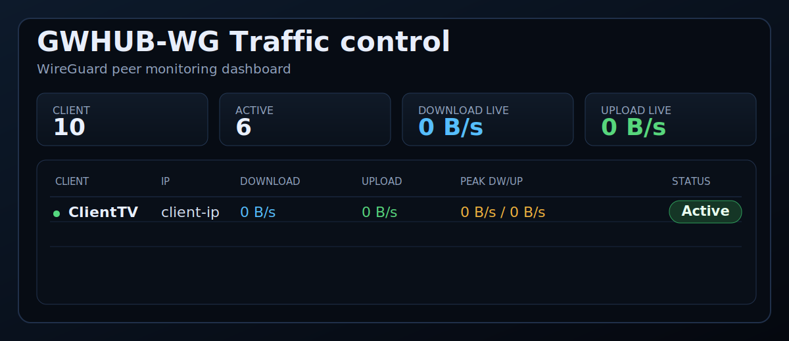
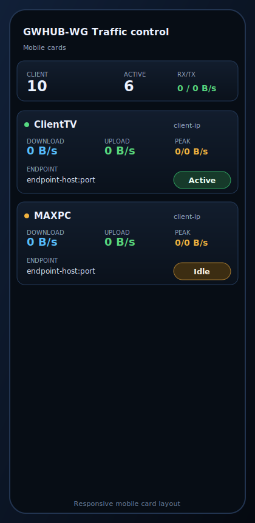

# WG Interface Traffic Control

Web UI Python in file singolo per monitorare in tempo reale il traffico peer WireGuard.

> 🇬🇧 [Read in English](README.md)

## Anteprima

<p align="center">
  
</p>
<p align="center">
  
</p>

## Panoramica Progetto

Questo progetto include:

- Tabella peer in tempo reale (download, upload, picco, totali, endpoint, stato)
- Dashboard con aggiornamento automatico delle statistiche WireGuard
- Applicazione standalone (`trafficowg_web.py`)
- Script `install.sh` e `uninstall.sh` pronti all'uso
- Modalità `systemd` per produzione e `local` per test rapidi

## Struttura Repository

```text
├── trafficowg_web.py      # App principale web UI
├── install.sh             # Installer (auto/systemd/local)
├── uninstall.sh           # Uninstaller (auto/systemd/local)
├── README.md              # Documentazione inglese
├── README.it.md           # Documentazione italiana
└── docs/
    └── images/
        ├── overview.svg   # Anteprima desktop
        └── mobile.svg     # Anteprima mobile
```

## Installazione (3 punti)

1. Copia i file sul server:

```bash
mkdir -p /opt/trafficowg
cp trafficowg_web.py install.sh uninstall.sh /opt/trafficowg/
chmod +x /opt/trafficowg/trafficowg_web.py /opt/trafficowg/install.sh /opt/trafficowg/uninstall.sh
```

2. Esegui installer in modalità `systemd`:

```bash
cd /opt/trafficowg
sudo bash install.sh --mode systemd --bind <SERVER_BIND_IP> --port 65430 --if wg0
```

3. Apri la UI:

```text
http://<SERVER_BIND_IP>:65430/
```

## Comandi Rapidi

```bash
# Setup consigliato one-shot
bash install.sh

# Modalità locale per test
bash install.sh --mode local --bind <LOCAL_BIND_IP> --port 65430

# Rimozione servizio
sudo bash uninstall.sh --mode systemd --purge

# Stop istanza locale
bash uninstall.sh --mode local --purge
```

## Variabili Ambiente

- `TRAFFICOWG_BIND` (default: `0.0.0.0`)
- `TRAFFICOWG_PORT` (default: `65430`)
- `TRAFFICOWG_IF` (default: `wg0`)
- `TRAFFICOWG_REFRESH_MS` (default: `2000`)

## Note

- Tutte le immagini nel repository sono sanitizzate (nessun IP reale).
- `/usr/local/bin/trafficowg` è solo CLI; la web UI gira da `trafficowg_web.py`.
